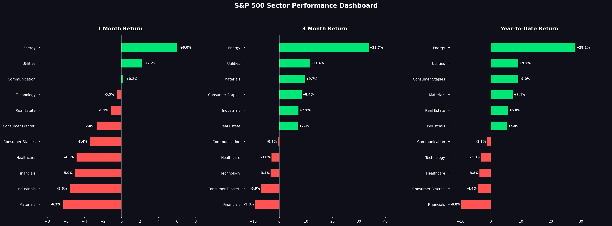

# S&P 500 Sector Performance Dashboard

A Python-based financial analytics dashboard that pulls **live market data** and visualizes S&P 500 sector returns across multiple time periods. Built as a portfolio project combining finance and data science skills.



---

## What It Does

- Pulls real-time price data for all 11 S&P 500 sector ETFs using Yahoo Finance
- Calculates **1 Month, 3 Month, and Year-to-Date returns** for each sector
- Generates a static chart ready to share on LinkedIn or in reports
- Generates a fully **interactive HTML dashboard** viewable in any browser
- Exports a clean CSV of all sector returns

## Sample Output (March 2026)

| Rank | Sector | 1M | 3M | YTD |
|------|--------|----|----|-----|
| 1 | Energy | +6.0% | +33.7% | +28.2% |
| 2 | Utilities | +2.2% | +11.4% | +9.2% |
| 3 | Consumer Staples | -3.4% | +8.4% | +9.0% |
| 10 | Consumer Discret. | -2.6% | -6.9% | -4.4% |
| 11 | Financials | -5.0% | -9.3% | -9.8% |

---

## Project Structure

```
sp500-dashboard/
├── data/
│   ├── raw/                  # Raw price data (not tracked by git)
│   └── processed/            # Calculated returns (not tracked by git)
├── notebooks/
│   └── 01_exploration.ipynb  # Full analysis walkthrough
├── src/
│   └── main.py               # Main script - runs full pipeline
├── outputs/
│   ├── charts/               # Static PNG charts
│   └── dashboards/           # Interactive HTML dashboards
├── tests/
│   └── test_calculations.py  # Unit tests for return calculations
├── requirements.txt
└── .gitignore
```

---

## Setup & Usage

**1. Clone the repo**
```bash
git clone https://github.com/NoahMusick4/sp500-dashboard.git
cd sp500-dashboard
```

**2. Install dependencies**
```bash
pip install -r requirements.txt
```

**3. Run the dashboard**
```bash
python src/main.py
```

This will:
- Pull live sector data from Yahoo Finance
- Print a ranked returns table in the terminal
- Open a static matplotlib chart
- Save an interactive Plotly dashboard to `outputs/dashboards/`
- Save a CSV of returns to `data/processed/`

**4. Explore the notebook**
```bash
jupyter notebook notebooks/01_exploration.ipynb
```

---

## Tech Stack

| Tool | Purpose |
|------|---------|
| Python | Core language |
| yfinance | Live market data from Yahoo Finance |
| pandas | Data manipulation and return calculations |
| matplotlib | Static chart generation |
| plotly | Interactive dashboard |
| Jupyter | Exploratory analysis notebook |

---

## Sector ETFs Tracked

| Sector | ETF |
|--------|-----|
| Technology | XLK |
| Healthcare | XLV |
| Financials | XLF |
| Consumer Discretionary | XLY |
| Consumer Staples | XLP |
| Industrials | XLI |
| Energy | XLE |
| Utilities | XLU |
| Real Estate | XLRE |
| Materials | XLB |
| Communication | XLC |

---

## Skills Demonstrated

- Financial data retrieval and processing
- Time-series return calculations
- Data visualization (static and interactive)
- Python project structure and modular code
- Git version control

---

## Authors

Built by Noah Musick — Finance & Data Science student at Capital University.

[Connect on LinkedIn](https://www.linkedin.com/in/noah-musick-674ba4332) | [View more projects on GitHub](https://github.com/NoahMusick4)
